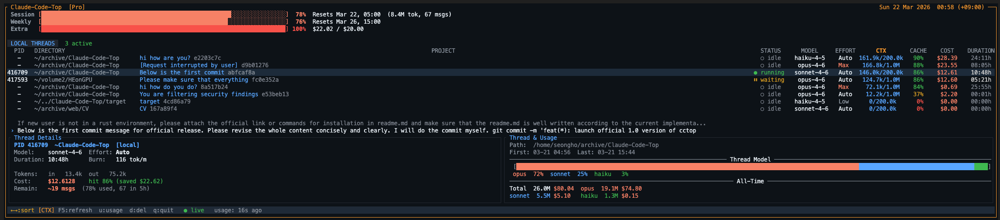

```
                 __
      ___  ___  / /_  ____    ____
     / __\/ __\/ __/ / __ \  / __ \
    / /_ / /_ / /__ / /_/ / / /_/ /
    \___/\___/\___/ \____/ /  ___/
                          /_/
    cctop: Claude Code Top
```

**A top-style CLI terminal monitor for Claude Code sessions.**

Track token usage, costs, session quotas, and active threads — all in real-time from your terminal.



---

## Requirements

- **Claude Code** installed with local data at `~/.claude/`
- **Rust toolchain** (`cargo`)
- **tmux** (for fallback API fetching on macOS)

| OS | Support Status |
|:---:|:---|
| **Ubuntu** | ✅ Supported |
| **macOS** | ✅ Supported |

> 🙋‍♂️ **Need Support for Another OS?**  
> Feel free to leave a request via [Email](mailto:seongho-kim@yonsei.ac.kr) or [GitHub Issues](https://github.com/seongho-git/Claude-Code-Top/issues)!

---

## Dependencies Installation

### 1. Install Claude Code

If you haven't installed Claude Code yet:

```bash
curl -fsSL https://claude.ai/install.sh | bash
```

### 2. Install Rust

If you don't have Rust installed, run the official installer:

```bash
curl --proto '=https' --tlsv1.2 -sSf https://sh.rustup.rs | sh
```

```bash
# Then reload your shell environment:
source "$HOME/.cargo/env"

# Verify the installation:
cargo --version
```

> For more details, see the official guide at **https://rustup.rs/**

### 3. Install tmux (Required)

Since `cctop` uses `tmux` in the background as a fallback for usage tracking when direct API fetch fails (especially on macOS), you must have `tmux` installed.

```bash
# macOS (using Homebrew)
brew install tmux

# Ubuntu/Debian
sudo apt install tmux
```

---

## Installation

### Quick Install

```bash
git clone [https://github.com/seongho-git/Claude-Code-Top.git](https://github.com/seongho-git/Claude-Code-Top.git)
cd Claude-Code-Top
source install.sh
```

The install script builds the binary, copies it to `~/.claude-code-top/`, and saves your plan selection to `~/.cctop.json`.

### Manual Build

```bash
cargo build --release
./target/release/cctop --plan max5
```

### Add to PATH

```bash
# zsh
echo 'export PATH="$HOME/.claude-code-top:$PATH"' >> ~/.zshrc && source ~/.zshrc

# bash
echo 'export PATH="$HOME/.claude-code-top:$PATH"' >> ~/.bashrc && source ~/.bashrc
```

---

## Usage

```bash
cctop                    # Launch (uses saved plan)
cctop --plan pro         # Set plan: pro, max5, max20
cctop --update-usage     # Refresh quota data from Anthropic API
```

`--update-usage` first attempts a live fetch from the Anthropic OAuth API. If that fails (e.g. no credentials), it automatically falls back to running `update.sh` in the background (using tmux) to safely scrape the `/usage` output. If this script is unavailable, it falls back to prompting you to paste the text manually.

### Keybindings

| Key | Action |
|-----|--------|
| `↑` / `k` | Select previous thread |
| `↓` / `j` | Select next thread |
| `←` / `h` | Sort by previous column |
| `→` / `l` | Sort by next column |
| `s` / `F2` | Cycle sort column forward |
| `r` / `F5` | Force refresh |
| `u` | Refresh server-side quota |
| `d` / `Del` | Delete selected thread |
| `q` / `Ctrl+C` | Quit |

---

## What It Shows

### Header — Usage Bars

Three single-line progress bars showing real-time quota consumption:

- **Session** — 5-hour rolling token window
- **Weekly** — 7-day spending limit
- **Extra** — OAuth-based extra usage tier

Data is fetched from Anthropic's OAuth API using credentials stored in `~/.claude/.credentials.json`. Refreshes every 60 seconds while threads are active, every 5 minutes otherwise.

The layout degrades gracefully as the terminal shrinks: the recent commands panel hides first, then the detail panel, then the thread list compresses.

### Thread List

| Column | Description |
|--------|-------------|
| PID | Process ID (if Claude is actively running) |
| DIRECTORY | Shortened path: `/first/../parent/folder` |
| PROJECT | First 2 words of last user message + session ID |
| STATUS | `● running` / `⏸ waiting` / `○ idle` / `✕ error` |
| MODEL | Active model (e.g. `opus-4-6`, `sonnet-4-6`) |
| EFFORT | Inferred effort level: Low / Auto / High / Max |
| CTX | Context tokens used vs. model maximum |
| CACHE | Cache hit rate |
| COST | Estimated total API cost |
| DURATION | Session duration |

Columns auto-hide from right to left as the terminal narrows, prioritizing the PROJECT column content. A recent commands panel appears above the detail panel when enough vertical space is available.

### Detail Panel

Split into two halves at the bottom of the screen:

**Thread Details (left)**
- PID, project name, and active status
- Model (shortened), effort level, session duration, burn rate
- Token breakdown: input / output counts
- Cost with cache hit rate and savings estimate
- Messages remaining in the current 5-hour session window
- Model Mix: tier distribution bar + one-line percentage breakdown (Opus / Sonnet / Haiku)

**Thread & Usage (right)**
- Full project path, first and last activity timestamps
- All-time totals: token count and cost aggregated by model tier
- Recent Commands: last 3 user messages sent in the session

---

## How It Works

1. **Process Detection** — Scans running processes for `claude` executables via `sysinfo`, matches each process's CWD to a project directory under `~/.claude/projects/`
2. **JSONL Parsing** — Reads conversation logs at `~/.claude/projects/<encoded-path>/*.jsonl` with mtime-based caching to avoid redundant I/O
3. **Cost Calculation** — Applies per-model pricing (Opus / Sonnet / Haiku) including cache read/write rates to compute accurate cost and savings estimates
4. **OAuth Quota** — Fetches live session, weekly, and extra usage from `api.anthropic.com/api/oauth/usage` using the OAuth token stored by Claude Code. If the API fetch fails, a fallback script (`update.sh`) runs Claude Code automatically in the background via `tmux` to parse the `/usage` info.
5. **2s Refresh Cycle** — Lightweight polling: only process metadata is refreshed each cycle; JSONL files are re-parsed only when their mtime changes

---

## References

- [claude-code-usage-monitor](https://github.com/Maciej-Gutkowski/claude-code-usage-monitor) — Python TUI that inspired the session model and JSONL parsing approach
- [ccusage](https://github.com/ryoppippi/ccusage) — Source for the Anthropic OAuth usage API endpoint
- [Ratatui](https://ratatui.rs/) — Rust terminal UI framework
- [Anthropic API Pricing](https://docs.anthropic.com/en/docs/about-claude/models) — Model pricing reference

---

## License

MIT

## Author

**Seongho Kim** — Yonsei University
- [seongho-kim@yonsei.ac.kr](mailto:seongho-kim@yonsei.ac.kr)
- [@seongho-git](https://github.com/seongho-git)
